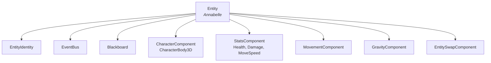
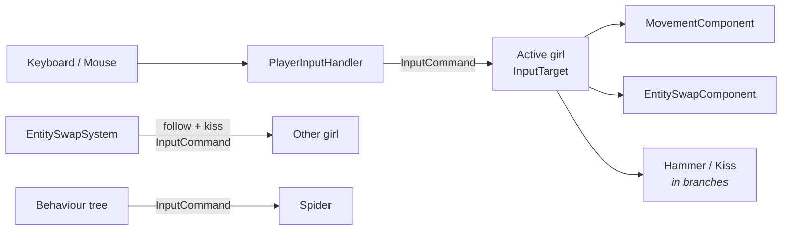
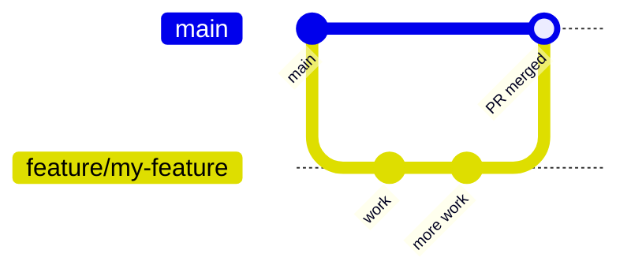

# 🔨❤️ Hammer and Heart

> A linear, single-player 3D action-adventure where **the enemies attack you because they see you as a threat**.
> Elaine smashes robots with her hammer. Annabelle calms monsters with heart-shaped kisses. Together they try to escape the Catacombs **without causing any harm**.

Built with **Godot 4.5 (.NET)** and **C#**, on a small in-house ECS.

| | |
|---|---|
| **Engine** | Godot 4.5 .NET (Forward Plus) |
| **Language** | C# (.NET 8, nullable enabled) |
| **Target for the demo** | One level + the Eye Spy boss |
| **Task board** | [Trello](https://trello.com/b/z7xJU6rQ/my-trello-board) |
| **Design doc** | Hammer and Heart GDD (ask the lead for the latest version) |

---

## 📑 Contents

- [Getting started](#-getting-started)
- [Controls](#-controls)
- [Project status](#-project-status)
- [Project structure](#-project-structure)
- [Architecture](#-architecture)
- [Git workflow](#-git-workflow)
- [Known issues](#-known-issues)

---

## 🚀 Getting started

### Requirements

- **Godot 4.5 .NET** (the *mono* / C# build, not the standard one)
- **.NET SDK 8** or newer

### Run the game

1. Clone the repo and open **`project.godot`** from the Godot project manager.
2. Click **Build** (hammer icon, top right) so the C# assembly is compiled.
3. Press **F5**. The main scene is `test_scene.tscn`.

You can also build from the terminal:

```bash
dotnet build "Hammer and Heart.sln"
```

> [!WARNING]
> If your Godot version differs from the project's, Godot rewrites `Hammer and Heart.csproj` (and may create a `.csproj.old`). **Don't commit those changes**. Discard them, or align your Godot version with the team.

---

## 🎮 Controls

An in-game **controls panel** (top left) always shows the current controls. Press **F2** to hide it, e.g. when recording videos.

Two control schemes are being playtested (GDD p.6). Press **F1** to switch between them at any time:

| Action | Keyboard / mouse | Gamepad | 🔁 Switching *(default)* | 🧑‍🤝‍🧑 Two-headed unit |
|---|---|---|---|---|
| Move | `WASD` | Left stick / D-pad | ✅ | ✅ |
| Aim | `Mouse` | Aims where you walk | ✅ | ✅ |
| Attack | `Left click` | `Cross` / `R2` | Active girl (hammer or kiss) | Elaine's hammer |
| Kiss | `Right click` | `Square` / `L2` | — | Annabelle's kiss |
| Switch girl | `Tab` | `Circle` | ✅ | Disabled |
| Pause and options | `Esc` | `Start` | ✅ | ✅ |
| Change scheme | `F1` | `L1` | ✅ | ✅ |
| Hide/show controls panel | `F2` | `Select` | ✅ | ✅ |

In *Switching* the girl you control leads; in *Two-headed unit* Elaine always leads.

With a mouse, characters face the point it is over. On a gamepad they face where they walk, which
is easier than aiming with a stick; the handler switches between the two with the last input used.
Kisses also get a small **aim assist**: a shot fired within `AimAssistAngle` of a monster curves
onto it, so aiming does not have to be pixel perfect. Set the angle to 0 on `KissAttackComponent`
to turn it off, for instance in a boss fight that asks for real precision (GDD p.8).

> [!NOTE]
> Only one scheme will stay in the final game. The hammer and kiss attacks live in their own branches for now (see [Project status](#-project-status)), so the attack buttons don't do anything visible on `main` yet.

---

## 📊 Project status

### ✅ On `main`

| Feature | Notes |
|---|---|
| **ECS core** | Entities, components, per-entity event bus, blackboard |
| **Stats** | Health, Damage, MoveSpeed with modifiers |
| **Character switching** | Pair follow + position swap on `Tab` |
| **Control scheme toggle** | `F1` between Switching and Two-headed unit |
| **Camera follow** | Smooth follow, camera zones, level bounds |
| **Behaviour trees** | Generic node library + a test spider AI |
| **Dev controls panel** | `F2` to hide |
| **Pause and options** | `Esc` pauses the game; music, sound and brightness, saved between sessions |

### 🚧 In progress (separate branches)

| Branch | What it adds | Before merging |
|---|---|---|
| `feature/hammer-combat` | Elaine's hammer swing, animation and hitbox | Resolve collision layer conflicts in `elaine.tscn` / `spider.tscn` |
| `feat-anna-kiss-projectile` | Annabelle's kiss projectile (straight + lobbed shots) and the Calm system | Review and merge |

### 📋 Up next (Trello *To do*)

Enemy faction (Monster vs Robot) · Calm stat + calmed state · Robot enemy · Monster field effects · Damage, defeat and respawn · Health bar UI · Hammer combos · Annabelle's soup healing

---

## 🗂️ Project structure

```
📦 Hammer and Heart
├── 📄 project.godot              Engine config, input map, GameCore autoload
├── 🎬 test_scene.tscn            Main scene: level, girls, spider, camera, systems
├── 📜 TestScene.cs               Bootstraps entities, stats, swap system and AI
├── 🕷️ SpiderAi.cs + *Action.cs   Test spider behaviour tree and its actions
│
├── 📁 common/                    Reusable engine-side code (no game content)
│   ├── scenes/game_core/         GameCore autoload: global event bus + logging setup
│   ├── systems/
│   │   ├── ai/behavior_trees/    Behaviour tree nodes (Sequence, Selector, Cooldown…)
│   │   ├── camera/               CameraRig, CameraZone, camera_rig.tscn
│   │   ├── entities/             ECS: Entity, ComponentBase, components, events
│   │   ├── event_bus/            Typed pub/sub with priorities
│   │   ├── input/                Input handlers, InputCommand, ControlScheme
│   │   ├── stats/                Stat types and modifiers
│   │   ├── timing/               TimerManager + countdown timers
│   │   ├── Blackboard.cs         Key/value store used by AI
│   │   └── EntitySwapSystem.cs   Active girl, pair follow, control schemes
│   ├── ui/                       ControlsHelpPanel (dev overlay)
│   └── utilities/                Logging, extension methods
│
└── 📁 main/                      Game content: characters, level, enemies
    ├── annabelle.tscn
    ├── elaine.tscn
    ├── spider.tscn
    └── test_level.tscn
```

**Rule of thumb:** generic systems go in `common/`, anything specific to *Hammer and Heart* (characters, levels, enemies) goes in `main/`.

---

## 🏗️ Architecture

### Entities and components

Every character is an **`Entity`** node whose child nodes are **components**. Components register themselves when they enter the tree, and they talk to each other through the entity instead of direct references.



```csharp
var character = entity.GetComponent<CharacterComponent>()?.Character;
float speed = entity.GetComponent<StatsComponent>()?.GetStat(StatType.MoveSpeed)?.CurrentStatValue ?? 0f;
```

> [!IMPORTANT]
> Call `entity.Initialize(new EntityIdentitySpec())` **before** using an entity. `TestScene.cs` does this for every entity in the scene.

### Factions: Monster vs Robot

Every entity has a **`Faction`** on its `EntityIdentity` (`None`, `Monster` or `Robot`), set in the inspector or through `EntityIdentitySpec`. Use it to decide which attacks affect a target instead of checking names:

```csharp
if (target.IsRobot)   { /* Elaine's hammer deals damage */ }
if (target.IsMonster) { /* Annabelle's kiss raises Calm */ }
```

The girls are `None` and the spider is `Monster`.

### Calming monsters

Monsters are never damaged, they are calmed (GDD p.4). A **`CalmComponent`** holds a `StatType.Calm`
stat; Annabelle's kisses raise it and, once it is full, the monster is calmed for good:

```csharp
entity.GetComponent<CalmComponent>()?.AddCalm(25f);   // true when this hit calmed it
```

Once the first kiss lands, a small bar above the monster fills up pink as it calms down
(GDD p.20). When it is full the bar is replaced by a pink heart, the monster's behaviour tree
stops and a **`MonsterCalmedEvent`** is published on its own event bus and on the global one, so
counters and field effects can listen for it. Both indicators are placeholders until the enemy
HUD exists.

### Input flow

Input is turned into an immutable **`InputCommand`** and sent to every component that implements **`IInputReceiver`**. AI uses the same path, so a component doesn't care whether a player or a behaviour tree is driving it.



**`EntitySwapSystem`** decides who the active girl is, makes the other one follow, and applies the active **`ControlScheme`**. In *Two-headed unit*, the kiss button reaches Annabelle as her `AttackPressed`, so attack components work in both schemes without changes.

### Events

Each entity has its own `EventBus`, and `GameCore.Instance.EventBus` is the global one.

```csharp
entity.EventBus.AddListener<PlayerSwapEvent>(OnPlayerSwap);
entity.EventBus.Publish(new PlayerSwapEvent());
```

### Camera

Add **`common/systems/camera/camera_rig.tscn`** to a level and assign its `Targets` (the girls). It follows their average position, so switching girls never makes it jump.

To change the framing in part of a level, add a **`CameraZone`** (an `Area3D` with a collision shape) and set its `Distance`, `PitchDegrees`, `YawDegrees` and `CameraPriority`.

> [!IMPORTANT]
> A `CameraZone`'s **collision mask must include layer 2** (the characters' layer), or the girls won't trigger it.

### Collision layers

| Layer | Used by |
|---|---|
| 1 | Level geometry (floor, walls) |
| 2 | Characters (girls, spider) |

### Timers and logging

- Timers are updated by `TimerManager.UpdateTimers(delta)` (called from `TestScene._Process`).
- Use `LoggerService.Info/Warning/Error/Debug(...)` instead of `GD.Print`. The level is set with `LoggerService.SetLogLevel`.

---

## 🌿 Git workflow



1. **Branch from an up-to-date `main`**: `feature/<short-name>` (e.g. `feature/robot-enemy`).
2. Keep changes to **shared scenes** like `test_scene.tscn` small; put new systems in **new files** to avoid conflicts.
3. **Before opening a PR**, merge or rebase the latest `main` into your branch and test it.
4. Open a **PR to `main`**. If another branch is built on top of yours, merge with **"Create a merge commit"** or **"Rebase and merge"**, **not "Squash"**, or the dependent branch will show your commits again.
5. **Delete the branch** once it's merged.

**Conventions**

- Commit messages in **English**, imperative mood: `Add camera follow system`.
- **Commit the `.uid` files** Godot generates next to scripts and scenes.
- **Don't commit** `.csproj` / `.csproj.old` changes caused by a different Godot version.
- Record a **short video** when a feature lands so progress can be shared with the lead.

**Archived branches.** Old branches that were never merged are kept as tags, so nothing is lost:

| Tag | Content |
|---|---|
| `archive/development` | Earlier ECS refactor (component-system-2.0) |
| `archive/FSM` | Finite state machine and AI follow state |
| `archive/character-switch` | Empty test scene for character switching |

```bash
git switch -c development archive/development   # restore one as a branch
```

---

## 🐛 Known issues

| Issue | Where | Details |
|---|---|---|
| 🕷️ **Spider gets stuck** | `SpiderAi.cs`, `IdleAction.cs` | After overshooting its target it switches to *Idle* forever and keeps sliding into a wall. Idle doesn't stop movement, the selector never retries the chase, and it never switches targets. |
| ⚡ **Movement is very fast** | `TestScene.cs` | `MoveSpeed` is 30, so the girls cross the level in under a second. Around 5–8 feels playable. |
| 👻 **Characters pass through each other** | `annabelle/elaine/spider.tscn` | All on layer 2 with mask 1, so they don't collide with each other. |
